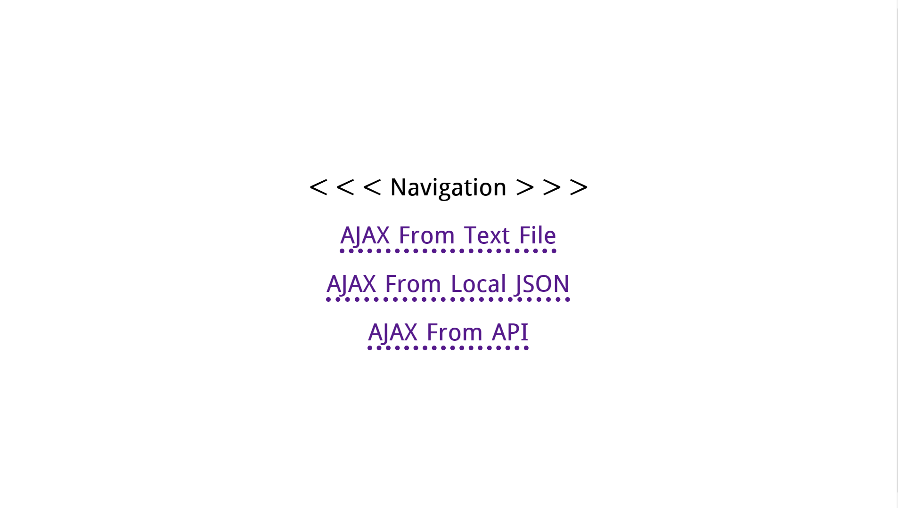
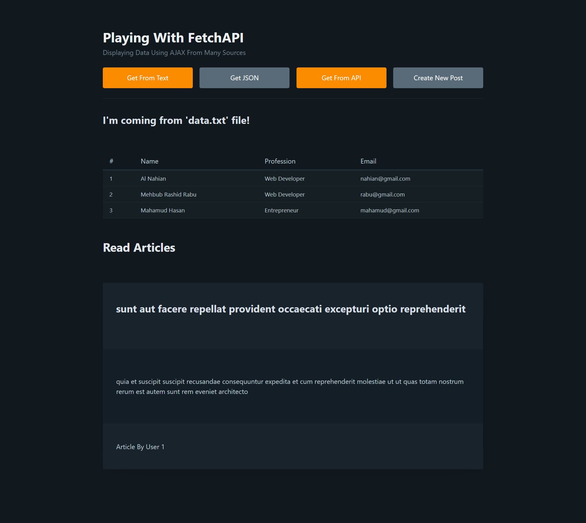

# 100JavaScriptProjects

I will try to build some simple miniature projects using Vanilla JavaScript. I decided to enrich my JS fundamentals and understand the core concepts for a better developer life experience 😀

## Project 1: Live Search Filter

In this project, I tried to implement one of the most interesting JavaScript String Methods, named `indexOf()` to make a life search filter among the data.

**[Live Demo](https://alnahian2003.github.io/100jsproject/filter.html)**

## Project 2: Dark/Light Theme Changer

Here it's a very simple Dark/Light theme toggler-switcher-changer (whatever you call it 😄) with some extra cool `localStorage` integration, which let's us save your preferenced theme on the browsers local storage and use it whenever you visit the page again.

**[Live Demo](https://alnahian2003.github.io/100jsproject/themechanger.html)**

## Project 3: Advanced Theme Changer

This is a newer and advanced version of the previous project. In this project, User Device default theme preference auto detect functionality added to improve accessibility.

**[Live Demo](https://alnahian2003.github.io/100jsproject/theme-changer-v2.html)**

## Project 4: Simple Skeleton Screen Loading Animation

This is a beginner friendly project to learn how to implement skeleton animation on the page to improve accessibility. Note: This project will have an updated version later

**[Live Demo](https://alnahian2003.github.io/100jsproject/skeleton-loader)**

## Project 5: Simple TODO List With LocalStorage

In this project, I tried implementing my basic understandings to build a very simple TODO list web app with the LocalStorage integration.
[This app has a tiny little bug in it. For example, if you input some list items and then refresh the page, you will see the data remains. but again if you input some new list items, and then refresh the page again, you'll see that the older list items has been removed instead new list items showing as a list! I dunno what to call it, as a bug or a feature 😅 You can name it whatever you want]

**[Live Demo](https://alnahian2003.github.io/100jsproject/todo.html)**

## Project 6: Playing With AJAX

I've learned to play with the basics of AJAX request in JavaScript. I will work more on this later.

**[Live Demo](https://alnahian2003.github.io/100jsproject/ajax)**

## Project 7: Playing With Fetch API

In this project, I did almost same stuffs as I did before on Project 6. But in this project I tried the Fetch API instead of xmlHttpRequest. I found it really smooth and more convenient!

[Pico CSS](https://picocss.com) is used in this project for base styles. I have plans to use this amazing CSS Framework on my further projects.

**[Live Demo](https://alnahian2003.github.io/100jsproject/fetch-api)**
